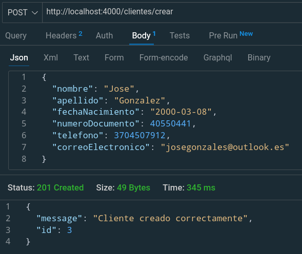
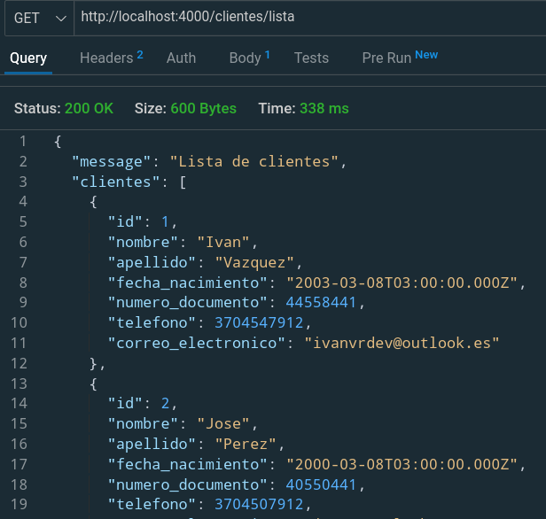
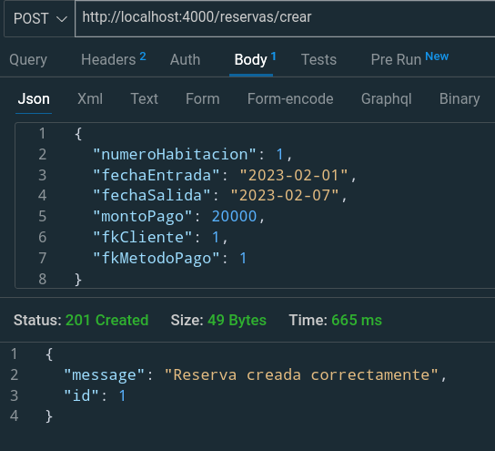
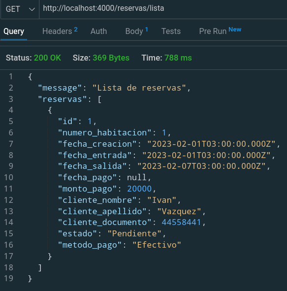
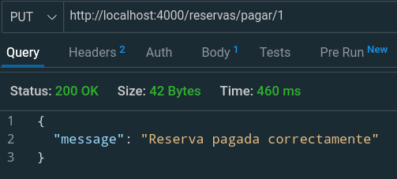
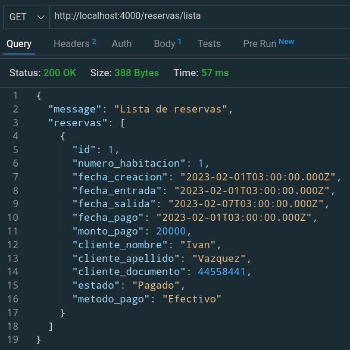
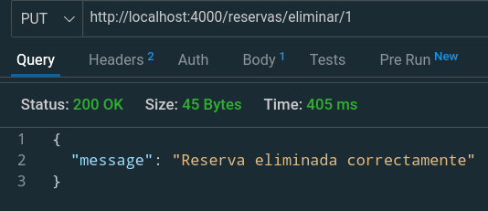
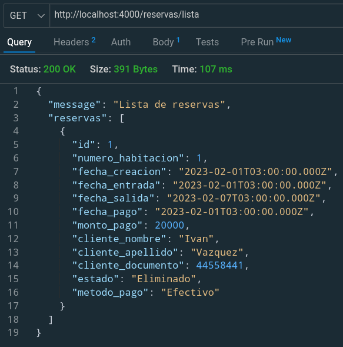
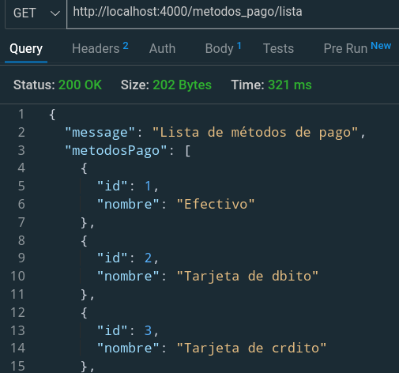

# PRUEBA TÉCNICA TuGerente

Este repositorio contiene el código del backend para el sistema de reservación de un hotel, hecho con NodeJS y Express, programado para operar con una base de datos MySQL. Además, contiene las sentencias SQL con la estructura de tablas de la base de datos en archivo "queries.sql" en la carpeta "db".

## Ejecución en docker

Desde la carpeta raíz del proyecto:

### Construir imagen:
~~~cmd
sudo docker build -t node-restapi .
~~~
### Correr contenedor:
(reemplazar estas variables de entorno por las propias)

~~~cmd
sudo docker run -it \
-e PORT=4000 \ 
-e DB_HOST=172.17.0.2 \ 
-e DB_NAME=sistema_reservacion_hotel \
-e DB_USER=root \
-e DB_PASSWORD=1234 \
-e DB_PORT=3306 \
-p 4000:4000 \
node-restapi
~~~

## Endpoints

### Clientes

Para poder reservar una habitación, primero debemos registrar al cliente en la base de datos. Para ello utilizamos el siguiente endpoint: 

`/clientes/crear` **POST**.

Formato:

~~~js
{
    nombre: String,
    apellido: String,
    fechaNacimiento: Date, //AAAA-MM-DD
    numeroDocuemento: Number,
    telefono: Number,
    correoElectronico: String
}
~~~

Si la operación es correcta el sistema nos devolverá el id del registro creado.

Ejemplo:

En caso de necesitar la lista de clientes, se puede obtener por medio del siguente endpoint:

`/clientes/lista` **GET**

Ejemplo:

### Reservas

Para crear la reserva, previamente necesitamos conocer el id del metodo de pago (se detallará después de esta sección) a emplear y el id del cliente. También, vamos a suponer que conocemos la lista de habitaciones y colocaremos sólo su número. Por defecto, la reserva se crea con el estado "Pendiente" y sin la fecha de pago. El endpoint y el formato son los siguientes: 

`/reservas/crear` **POST**

~~~js
    {
        numeroHabitacion: Number,
        fechaEntrada: Date, //AAAA-MM-DD
        fechaSalida: Date, //AAAA-MM-DD,
        montoPago: Number,
        fkCliente: Number,
        fkMetodoPago: Number
    }
~~~

Al igual que el endpoint para crear usuarios, este devuelve el id del registro creado en caso de éxito. 

Ejemplo:

Para obtener la lista de reservas se puede consultar el endpoint:
`/reservas/lista` **GET**

Ejemplo:

Para marcar una reserva como pagada tenemos que enviar como párametro el id de la misma a través del siguiente endpoint:

`/reservas/pagar/:id` **PUT**

Ejemplo:

De forma similar se puede eliminar una reserva con el siguiente endpoint:

`/reservas/eliminar/:id` **PUT**

Ejemplo:

### Métodos pago

En caso de necesitar la lista de métodos de pago para un combobox o similar, la podemos consultar a través del siguiente endpoint:

`/metodos_pago/lista` **GET**

Ejemplo:
